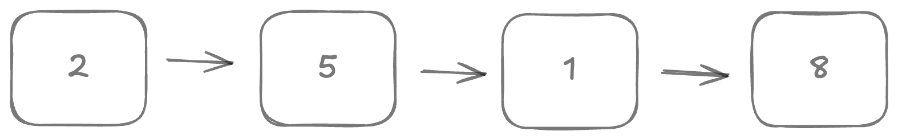
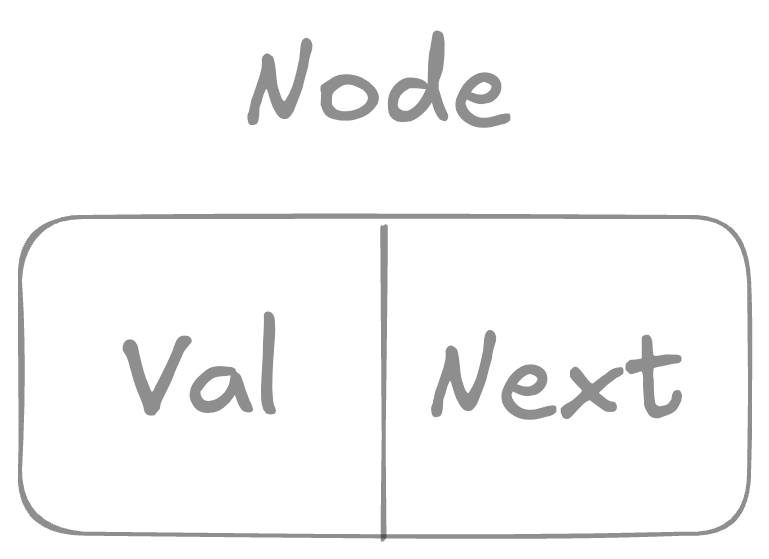
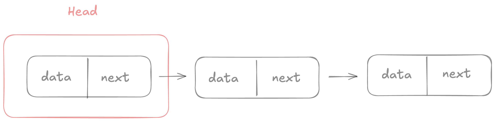

# Singly Linked List
> 是一種線性序列，但是並不會按線性的順序儲存資料，而是在每一個節點裡存到下一個節點的指標。



## 優點
- Dynamic size: 大小可以隨意增加刪除。
- Efficient performance: 第一個節點插入或刪除只需要 O(1)。

## 限制
- Extra space: 需要儲存節點資訊。
- Traversal: 必須先遍歷前面的節點才能存取某個特定 item。

## Node
Node 是 Linked List 的基本組成單位，儲存值與下一個節點的資料。




### Head Node
Linked list 第一個節點被稱作 Head Node，通常會透過 Head Node 來存取整個 Linked list



## 遍歷
必須遍歷 linked list，直到找到 next 為 nil 的節點，才可以知道其長度。

```go
for current := head; current != nil ;current = current.Next {
       // do sth
}

```

## Insertion
### 開頭
考量兩個情境：
- list 是空的 👉 回傳新建立的 Node
- list 不是空的 👉 將新建立的 Node.Next 指向 head
#### 複雜度分析 (Worst Case)
- Time Complexity - O(1)
- Space Complexity - O(1)

### 中間
### 結尾
考量兩個情境：
- list 是空的 👉 回傳新建立的 Node
- list 不是空的 👉 遍歷整個 List，將 Tail Node 的 Next 指向新建立的 Node

#### 複雜度分析 (Worst Case)
- Time Complexity - O(1)
- Space Complexity - O(N)