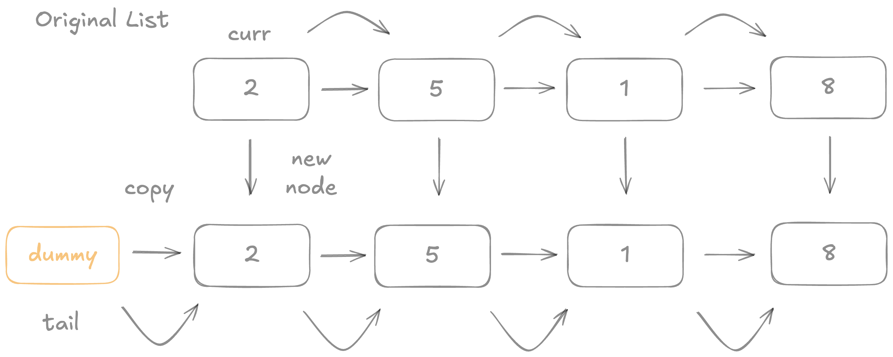

# Clone a List

## 問題
複製 Linked List 

### 範例：
```
Input: head = [1, 2, 3, 4, 5]
Output: [1, 2, 3, 4, 5]
```

## 思路
1. 創建一個 dummy Node
2. 建立一個 tail，將 tail 指向 dummy
3. 建立一個 curr，指向要被複製的 list 的 head
4. 遍歷 original list，每一階段建立新的 Node，將 tail 指向新的 Node
5. 移動 curr 跟 tail，直到 original list 遍歷完
6. 回傳 dummy.Next


